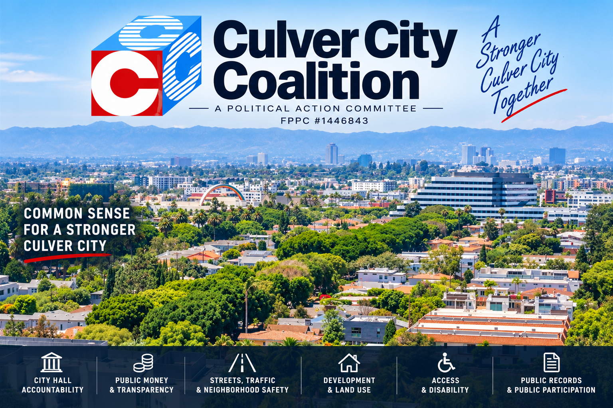

  

  <strong>COMMON SENSE FOR A STRONGER CULVER CITY</strong> 
  Resident-driven Political Action Committee · Culver City, California · FPPC #1446843

---

## WHAT WE'RE WATCHING

| 🏛️ **CITY HALL** | 💰 **PUBLIC MONEY** | 🚦 **OUR STREETS** |
|:---:|:---:|:---:|
| Accountability | Transparency | Traffic · Safety · Access |

| 🏘️ **DEVELOPMENT** | ♿ **ACCESS** | 📄 **PUBLIC PROCESS** |
|:---:|:---:|:---:|
| Land Use · Neighborhoods | Disability · Mobility | Records · Meetings · Participation |

---

## KNOW WHAT'S HAPPENING. SPEAK UP WHEN IT MATTERS.

**CCC follows the agendas, reads the records, tracks the money, and alerts residents when consequential decisions are being made.**

  <strong>ACTION ALERTS · CITY HALL · COMMUNITY · ACCOUNTABILITY</strong>

---

  <strong>CULVER CITY COALITION</strong> 
  <a href="https://www.culvercitycoalition.org/">culvercitycoalition.org</a>  
  <strong>FPPC #1446843</strong>

